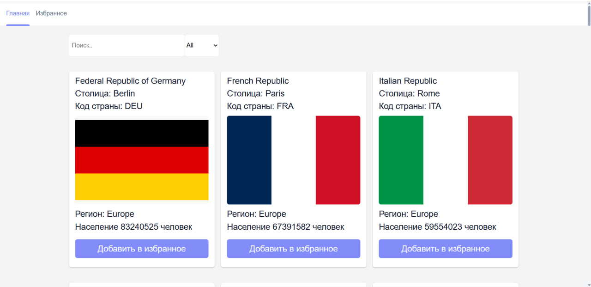
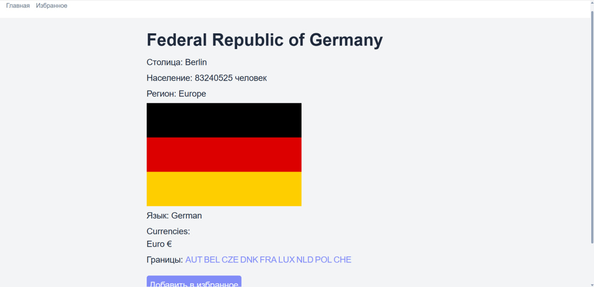
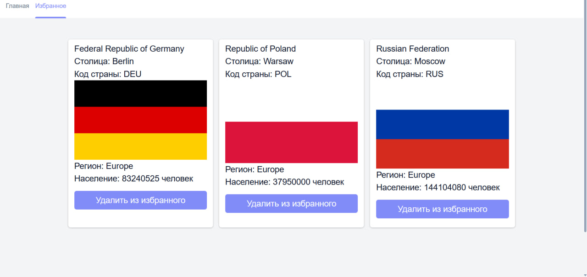

# 🌍 Countries Explorer

Приложение с информацией о 52 странах мира. Каждую страну можно изучить подробнее, а интересующие — добавить в избранное.

**[→ Живое демо](https://countries-explorer-blue.vercel.app/)**

---



---

## Что умеет приложение

- Поиск страны по названию с дебаунсом — запрос не летит на каждый символ
- Фильтрация по региону (Africa, Americas, Asia, Europe, Oceania)
- Страница деталей с языками, валютами, границами и флагом
- Избранное — сохраняется между сессиями через localStorage
- Переход между соседними странами прямо со страницы деталей

---

## Технические решения

**Сервисный слой**
`App` не знает о fetch. Все запросы изолированы в `services/` — `api.ts` универсальный транспорт, `countries.ts` конкретные функции с типами. Поменять источник данных можно в одном месте.

**useFetch с AbortController**
Кастомный хук принимает `fetcher`-колбек вместо URL. Это позволяет передавать параметры через замыкание — например `cca3` для страницы деталей. AbortController отменяет запрос при размонтировании компонента.

**Context + useReducer + lazy init**
Избранное управляется через `useReducer` с тремя экшенами: ADD, REMOVE, CLEAR_ALL. Начальное состояние читается из localStorage через функцию инициализации — один раз при монтировании, не на каждый рендер.

**Тесты**
Unit-тесты покрывают: утилиту `normalize`, reducer со всеми экшенами включая защиту от дублей, компоненты `CountryCard` и `FavoritesPage`, хук `useDebounce` с fake timers.

---

## Стек

|                          |                            |
| ------------------------ | -------------------------- |
| React 19 + TypeScript    | UI и типизация             |
| React Router v7          | Навигация, вложенные роуты |
| Vitest + Testing Library | Unit-тесты                 |
| CSS Modules              | Изолированные стили        |
| Vite                     | Сборка                     |

---

## Запуск локально

```bash
git clone https://github.com/SAGOMADGE/Countries-explorer
cd Countries-explorer
npm install
npm run dev
```

Тесты:

```bash
npm test
```

---

Страница деталей:


Страница избранных:



## Код-ревью и доработки

Проект прошёл код-ревью у практикующего senior-разработчика. По итогам внесены правки:

**Изоляция данных от устаревшего API.** REST Countries API сменил версию в процессе разработки, доступ к новому ключу получить не успел. Перешёл на локальный JSON с 52 странами — благодаря сервисному слою компоненты не пришлось трогать, поменялась только реализация `getAllCountries`/`getCountryByCode`.

**Битые переходы между странами.** Часть стран есть в `borders` API, но отсутствует в локальном JSON (например LUX) — переход по ним вёл на пустую страницу. Решение: в сервисном слое вынесен `Set` доступных кодов стран, страница деталей делает недоступные границы некликабельными вместо рендера ошибки.
